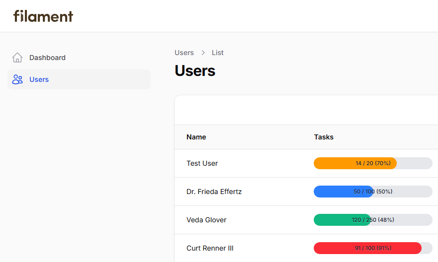
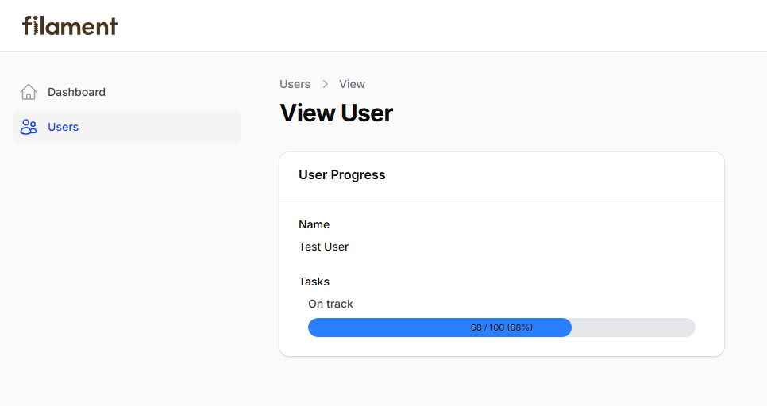

# Filament Progress Bar

[](https://packagist.org/packages/devletes/filament-progress-bar)
[](https://packagist.org/packages/devletes/filament-progress-bar)
[](https://packagist.org/packages/devletes/filament-progress-bar)
[](https://github.com/devletes/filament-progress-bar/stargazers)

Reusable progress bar components for Filament 5 tables and infolists.

## Requirements

- PHP `^8.2`
- Filament `^5.0`

## Installation

```bash
composer require devletes/filament-progress-bar
```

Then publish Filament assets so the package stylesheet is available to your panel:

```bash
php artisan filament:assets
```

This package ships its own Filament asset stylesheet, so you do not need to add it as a Tailwind source in your custom theme.

## Configuration

There is no published config file for this package. Configuration is done fluently on each table column or infolist entry.

Default behavior:

```php
[
    'size' => 'sm',
    'text_position' => 'inside',
    'show_progress_value' => true,
    'show_percentage' => true,
    'warning_threshold' => 70,
    'danger_threshold' => 90,
    'success_color' => 'var(--primary-500)',
    'warning_color' => 'var(--warning-500)',
    'danger_color' => 'var(--danger-500)',
]
```

Common things you can configure:

- `maxValue(...)`
- `label(...)` on `ProgressBarEntry`
- `inlineLabel()` on `ProgressBarEntry`
- `hiddenLabel()` on `ProgressBarEntry`
- `icon(...)` on `ProgressBarEntry`
- `iconColor(...)` on `ProgressBarEntry`
- `thresholds(...)`
- `warningThreshold(...)`
- `dangerThreshold(...)`
- `successColor(...)`
- `warningColor(...)`
- `dangerColor(...)`
- `successLabel(...)` on `ProgressBarEntry`
- `warningLabel(...)` on `ProgressBarEntry`
- `dangerLabel(...)` on `ProgressBarEntry`
- `showPercentage()`
- `hidePercentage()`
- `showProgressValue()`
- `hideProgressValue()`
- `size('sm' | 'md' | 'lg')`
- `textPosition('inside' | 'outside')`

## Usage

- Use `ProgressBarColumn` in Filament tables to show compact progress inside resource tables, relation managers, or custom tables.
- Use `ProgressBarEntry` in infolists for dashboards, widgets, welcome cards, detail pages, and summary sections.
- Provide either a numeric current value with `maxValue(...)`, or a structured array containing `progress` and `total`.
- When both progress value and percentage are shown, the display is rendered as `value / max (percentage)`.
- Thresholds are percentage-based by default: below `70%` is success, `70%` to `89%` is warning, and `90%+` is danger.
- Table columns intentionally do not render status labels above the bar. Status labels are intended for infolist entries.
- Invalid size, text position, threshold, color, and label values are normalized safely back to package defaults.

Table column example:

```php
use Devletes\FilamentProgressBar\Tables\Columns\ProgressBarColumn;

ProgressBarColumn::make('used')
    ->maxValue(fn ($record) => $record->quota)
    ->showProgressValue()
    ->showPercentage()
    ->textPosition('inside')
    ->size('sm');
```

Structured table state example:

```php
ProgressBarColumn::make('leave_progress')
    ->state(fn ($record) => [
        'progress' => $record->used_days,
        'total' => $record->allocated_days,
    ]);
```

Infolist example:

```php
use Devletes\FilamentProgressBar\Infolists\Components\ProgressBarEntry;

ProgressBarEntry::make('leave_progress')
    ->label('Sick Leave')
    ->icon('heroicon-o-heart')
    ->iconColor('primary')
    ->inlineLabel()
    ->getStateUsing(fn ($record) => [
        'progress' => $record->leave_used,
        'total' => $record->leave_total,
    ])
    ->showProgressValue()
    ->showPercentage()
    ->textPosition('inside')
    ->size('sm');
```

Threshold and label customization example:

```php
ProgressBarEntry::make('inventory')
    ->getStateUsing(fn ($record) => [
        'progress' => $record->used_stock,
        'total' => $record->max_stock,
    ])
    ->warningThreshold(75)
    ->dangerThreshold(95)
    ->warningColor('#f59e0b')
    ->dangerColor('#ef4444')
    ->warningLabel(fn ($percentage) => "High usage ({$percentage}%)")
    ->dangerLabel(fn ($current, $total) => "{$current} / {$total} used");
```

Supported state keys:

- current value: `progress`, `current`, `value`, `used`
- total value: `total`, `max`, `available`, `quota`

## Screenshots

### Table column usage



### Infolist entry usage



## Credits

- [Salman Hijazi](https://www.linkedin.com/in/syedsalmanhijazi/)

## License

MIT. See [LICENSE.md](LICENSE.md).
