# Filament Progress Bar

[](https://packagist.org/packages/devletes/filament-progress-bar)
[](https://packagist.org/packages/devletes/filament-progress-bar)
[](https://packagist.org/packages/devletes/filament-progress-bar)
[](https://github.com/devletes/filament-progress-bar/stargazers)

Reusable progress bar components for Filament 5 tables and infolists.

- Single shared API across `ProgressBarColumn` and `ProgressBarEntry`
- Three-tier (success / warning / danger) coloring out of the box, with custom colors via CSS values
- `ascending` and `descending` threshold directions for low-is-bad metrics (fuel, stock, battery)
- Optional threshold *map* for any number of states with custom names
- Three sizes, two text positions, custom border radius
- Self-contained stylesheet, dark-mode aware
- Proper `role="progressbar"` semantics

## Requirements

- PHP `^8.2`
- Filament `^5.0`

## Installation

```bash
composer require devletes/filament-progress-bar
```

Then publish Filament assets so the package stylesheet is available to your panel:

```bash
php artisan filament:assets
```

The package ships its own stylesheet via Filament's asset manager — there is nothing to add to your custom Tailwind theme.

## Quick start

### Table column

```php
use Devletes\FilamentProgressBar\Tables\Columns\ProgressBarColumn;

ProgressBarColumn::make('used')
    ->maxValue(fn ($record) => $record->quota)
    ->showProgressValue()
    ->showPercentage();
```

### Infolist entry

```php
use Devletes\FilamentProgressBar\Infolists\Components\ProgressBarEntry;

ProgressBarEntry::make('leave_progress')
    ->label('Sick Leave')
    ->icon('heroicon-o-heart')
    ->iconColor('primary')
    ->getStateUsing(fn ($record) => [
        'progress' => $record->leave_used,
        'total' => $record->leave_total,
    ]);
```

## Providing data

The component accepts two styles of state:

**1. A numeric value paired with `maxValue(...)`:**

```php
ProgressBarColumn::make('used')
    ->maxValue(fn ($record) => $record->quota);
```

**2. A structured array containing both the current value and the total:**

```php
ProgressBarColumn::make('leave_progress')
    ->state(fn ($record) => [
        'progress' => $record->used_days,
        'total' => $record->allocated_days,
    ]);
```

When the structured form is used, both keys are looked up flexibly. The first matching key wins:

| Role          | Accepted keys                                  |
|---------------|------------------------------------------------|
| Current value | `progress`, `current`, `value`, `used`         |
| Total         | `total`, `max`, `available`, `quota`           |

A missing or zero total resolves to `0%` rather than throwing.

## Display

### Size

Method: `size('sm' | 'md' | 'lg')`

Controls the bar height and inside-text size. Defaults to `sm`. Invalid values fall back to the default.

<table><tr>
<td width="50%">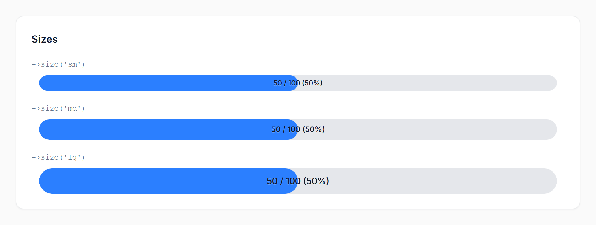</td>
<td width="50%">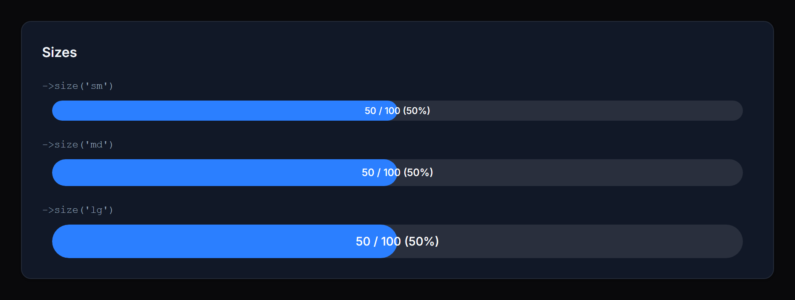</td>
</tr></table>

### Text position

Method: `textPosition('inside' | 'outside')`

- **`inside`** *(default)*: the value/percentage is rendered on top of the fill, centered horizontally. Best for compact rows where you want the number visually anchored to the bar.
- **`outside`**: the value/percentage is rendered in a row beneath the bar, right-aligned. Best when you want a clean bar visual without text overlap, or when the value would be hard to read at low percentages.

<table><tr>
<td width="50%">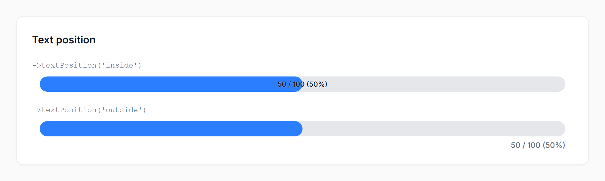</td>
<td width="50%">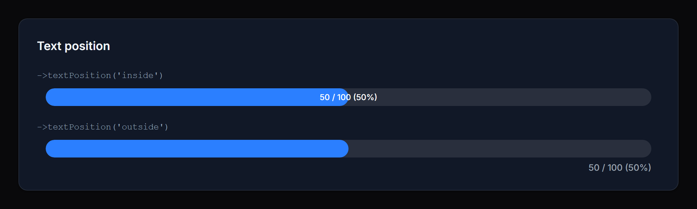</td>
</tr></table>

### Show / hide value & percentage

Methods: `showPercentage()` / `hidePercentage()` / `showProgressValue()` / `hideProgressValue()`

Toggle each portion of the display text independently. When both are visible the text reads `value / max (percentage)`. When only one is visible it appears alone. When both are hidden the bar renders without any text.

<table><tr>
<td width="50%">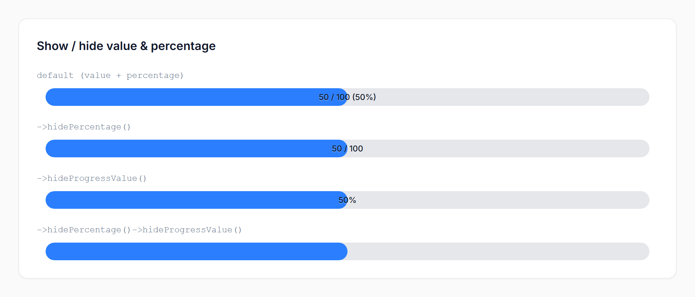</td>
<td width="50%">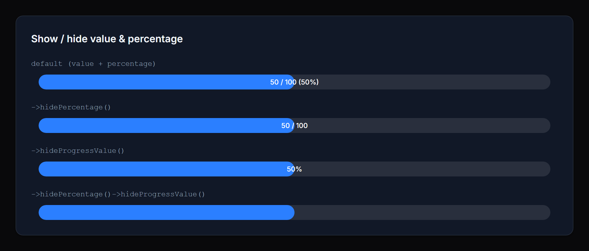</td>
</tr></table>

### Border radius

Method: `borderRadius(string $value)`

Override the bar's corner radius with **any valid CSS length** — pixels, rems, percentages, custom properties, or `calc()` expressions:

```php
->borderRadius('4px')
->borderRadius('0.5rem')
->borderRadius('calc(var(--radius) * 2)')
```

Pass `null` (or omit the call) to keep the default pill shape (`9999px`).

<table><tr>
<td width="50%">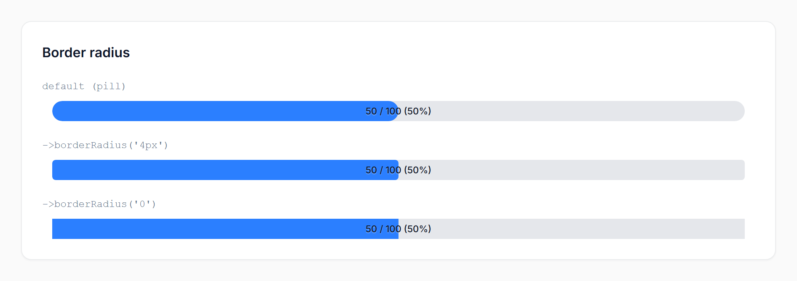</td>
<td width="50%">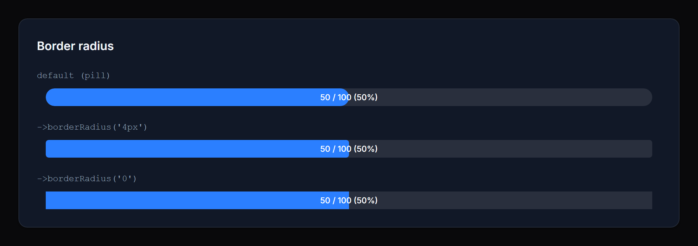</td>
</tr></table>

> Values containing `;`, `<`, `>`, `{`, `}`, or quotes are silently dropped to prevent inline-style injection. Stick to standard CSS length syntax.

## Thresholds and coloring

The bar resolves a **status** from the percentage and renders a color for that status. Two threshold APIs are available — start with the simple one and reach for the map only when three states aren't enough.

### Three-state mode (default)

`success` → `warning` → `danger`, with thresholds you can tune individually:

```php
ProgressBarColumn::make('cpu')
    ->warningThreshold(70)   // ≥ 70% → warning
    ->dangerThreshold(90);   // ≥ 90% → danger
```

Defaults: `warning = 70`, `danger = 90`.

<table><tr>
<td width="50%">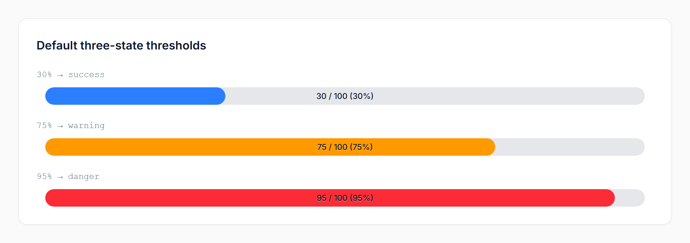</td>
<td width="50%">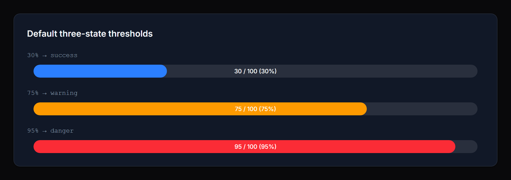</td>
</tr></table>

### Threshold direction

By default higher percentages escalate toward danger (CPU, memory, used quota). For metrics where **lower is worse** (fuel, stock, battery), flip the direction:

```php
ProgressBarColumn::make('battery_percent')
    ->thresholdDirection('descending')
    ->warningThreshold(30)   // ≤ 30% → warning
    ->dangerThreshold(10);   // ≤ 10% → danger
```

In descending mode the package uses sane defaults (`warning = 30`, `danger = 10`) and clamps `danger ≤ warning`.

<table><tr>
<td width="50%">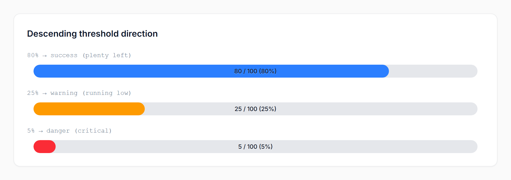</td>
<td width="50%">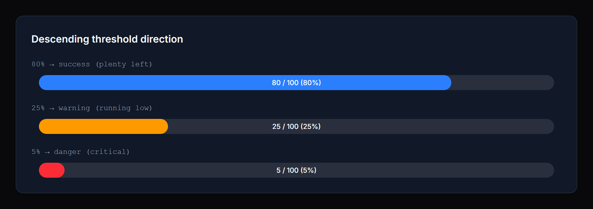</td>
</tr></table>

### Threshold map (advanced)

For more than three states, or for non-monotonic mappings, pass a map of `floor => status`. The status name can be anything you want:

```php
ProgressBarColumn::make('score')
    ->thresholds([
        80 => 'success',
        60 => 'warning',
        40 => 'info',
        0  => 'danger',
    ]);
```

Keys are interpreted as **percentage floors** — the highest matching floor wins. The example above maps `≥80` to `success`, `60–79` to `warning`, `40–59` to `info`, and `<40` to `danger`.

<table><tr>
<td width="50%">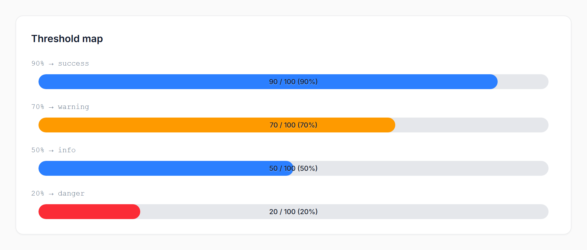</td>
<td width="50%">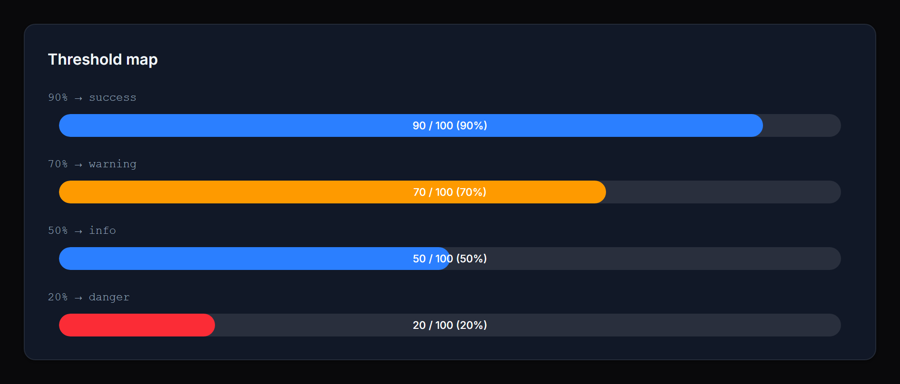</td>
</tr></table>

If you omit a `0` floor, the lowest-defined status extends down to `0`. For example, `[80 => 'success', 10 => 'info']` resolves `0–79` to `info` (no implicit `success` fallback below the lowest floor).

The three legacy statuses — `success`, `warning`, `danger` — keep their package defaults (`var(--primary-500)`, `var(--warning-500)`, `var(--danger-500)`). Any other status name (e.g. `info`, `gray`, `secondary`, or a custom one registered via your panel's `->colors([...])`) auto-resolves to `var(--{status}-500)`. No extra configuration needed.

For one-off colors that don't map to a Filament color (e.g. you want a specific `'excellent'` status to be a particular shade of green), use `statusColors([...])`:

```php
->statusColors([
    'excellent' => 'rgb(16 185 129)',
])
```

Likewise, custom labels for any status name go through `statusLabels([...])`:

```php
->statusLabels([
    'info' => fn (int $percentage) => "Watch ({$percentage}%)",
])
```

### Colors

Three named setters cover the default statuses. Each accepts any CSS color value or a closure:

```php
->successColor('rgb(16 185 129)')
->warningColor(fn ($record) => $record->is_critical ? '#ff0000' : 'orange')
->dangerColor('var(--my-danger-color)')
```

Defaults reference Filament's CSS variables (`var(--primary-500)`, `var(--warning-500)`, `var(--danger-500)`), so the bar inherits your panel's theme automatically.

For custom statuses (map mode), use `statusColors([...])`. When both `statusColors` and the named setters define the same status, the map wins — named setters fill in any keys the map omits.

### Labels

Per-status labels are shown above the bar in **infolist entries only** (table columns intentionally skip them for compact rows). They accept a string or a closure receiving useful context:

```php
->successLabel('On track')
->warningLabel(fn (int $percentage) => "Watch ({$percentage}%)")
->dangerLabel(fn (float $current, ?float $total) => "{$current} / {$total} used")
```

For custom statuses (map mode), use `statusLabels([...])`.

## Closure parameters

Most setters accept a closure. The following parameters are injected when present:

- `$state` — the raw column/entry state
- `$record` — the Eloquent model
- `$current` — the resolved current value (float)
- `$total` — the resolved total (float|null)
- `$percentage` — the integer percentage (0–100)
- `$status` — the resolved status name

The percentage- and status-aware parameters are populated *after* the bar's value has been resolved, so closures used for colors and labels can branch on the final percentage.

## Recipes

**Battery / fuel (low is bad):**

```php
ProgressBarColumn::make('battery_percent')
    ->thresholdDirection('descending')
    ->warningThreshold(30)
    ->dangerThreshold(10);
```

<table><tr>
<td width="50%">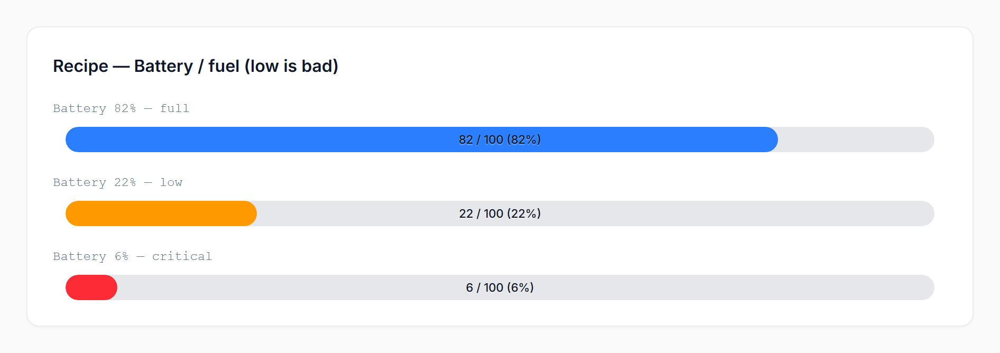</td>
<td width="50%">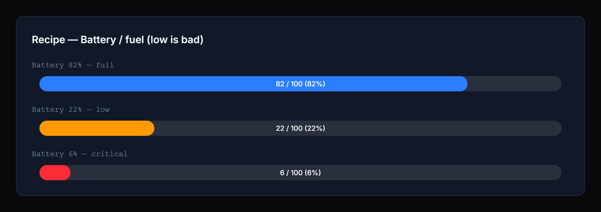</td>
</tr></table>

**Multi-state quality score** (using Filament's built-in colors):

```php
ProgressBarColumn::make('quality')
    ->thresholds([
        90 => 'success',
        70 => 'info',
        40 => 'warning',
        0  => 'danger',
    ]);
```

<table><tr>
<td width="50%">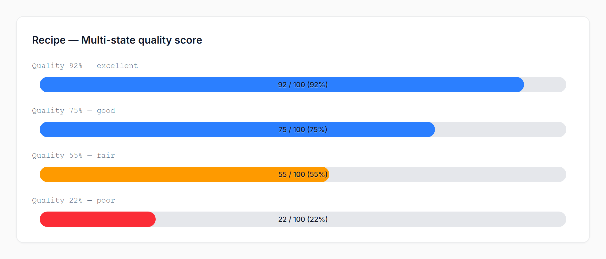</td>
<td width="50%">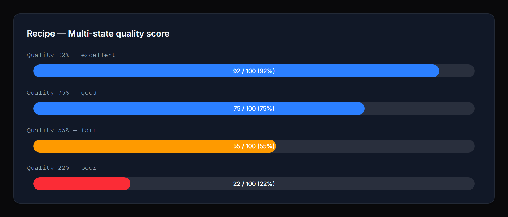</td>
</tr></table>

**Squared bars matching a card design system:**

```php
ProgressBarColumn::make('used')
    ->maxValue(fn ($record) => $record->quota)
    ->borderRadius('4px')
    ->size('md');
```

<table><tr>
<td width="50%">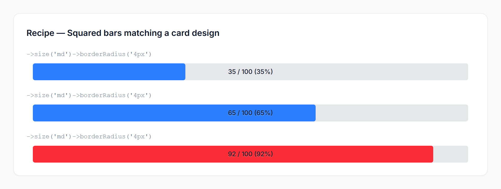</td>
<td width="50%">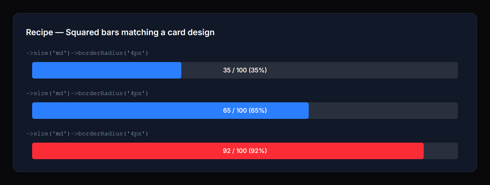</td>
</tr></table>

**Compact column without any text overlay:**

```php
ProgressBarColumn::make('leave_progress')
    ->state(fn ($record) => [
        'progress' => $record->leave_used,
        'total' => $record->leave_total,
    ])
    ->hideProgressValue()
    ->hidePercentage();
```

<table><tr>
<td width="50%">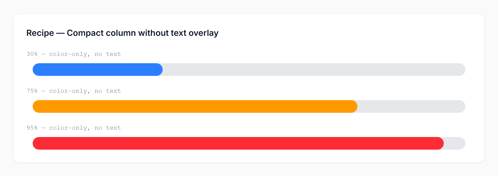</td>
<td width="50%">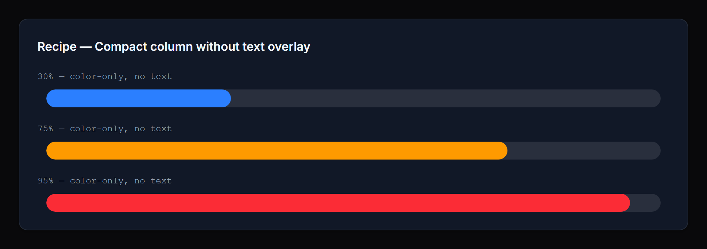</td>
</tr></table>

**Dynamic per-record color:**

```php
ProgressBarColumn::make('progress')
    ->successColor(fn ($record) => $record->is_priority ? '#7c3aed' : null);
```

**Infolist entry with icon, inline label, and rich danger text:**

```php
ProgressBarEntry::make('inventory')
    ->label('Stock remaining')
    ->icon('heroicon-o-cube')
    ->iconColor('primary')
    ->inlineLabel()
    ->getStateUsing(fn ($record) => [
        'progress' => $record->stock,
        'total' => $record->capacity,
    ])
    ->thresholdDirection('descending')
    ->warningThreshold(40)
    ->dangerThreshold(15)
    ->dangerLabel(fn (float $current, ?float $total) => "Only {$current} left of {$total}");
```

## API reference

### Value
| Method | Notes |
|---|---|
| `maxValue(int\|float\|Closure\|null)` | Used with a numeric state value |
| `state(...)` / `getStateUsing(...)` | Filament native; pass a structured array for current+total |

### Display
| Method | Notes |
|---|---|
| `size('sm'\|'md'\|'lg')` | Default `sm` |
| `textPosition('inside'\|'outside')` | Default `inside` |
| `showPercentage(bool\|Closure)` / `hidePercentage(bool\|Closure)` | Default shown |
| `showProgressValue(bool\|Closure)` / `hideProgressValue(bool\|Closure)` | Default shown |
| `borderRadius(string\|Closure\|null)` | Any CSS length; default pill |

### Thresholds
| Method | Notes |
|---|---|
| `warningThreshold(int\|float\|Closure)` | Default `70` (or `30` in descending) |
| `dangerThreshold(int\|float\|Closure)` | Default `90` (or `10` in descending) |
| `thresholdDirection('ascending'\|'descending'\|Closure)` | Default `ascending` |
| `thresholds(array\|Closure)` | Tier overrides OR a `[floor => status]` map |

### Colors
| Method | Notes |
|---|---|
| `successColor(string\|Closure\|null)` | Default `var(--primary-500)` |
| `warningColor(string\|Closure\|null)` | Default `var(--warning-500)` |
| `dangerColor(string\|Closure\|null)` | Default `var(--danger-500)` |
| `statusColors(array\|Closure\|null)` | Map of `status => color` for custom statuses |

### Labels (infolist entries only)
| Method | Notes |
|---|---|
| `successLabel(string\|Closure\|null)` | Hidden by default |
| `warningLabel(string\|Closure\|null)` | Hidden by default |
| `dangerLabel(string\|Closure\|null)` | Hidden by default |
| `statusLabels(array\|Closure\|null)` | Map of `status => label` for custom statuses |

### Infolist-only
The `ProgressBarEntry` extends Filament's `Entry` and supports the standard `label(...)`, `inlineLabel()`, `hiddenLabel()`, `icon(...)`, and `iconColor(...)` methods.

## Integration examples

A `ProgressBarColumn` rendered inside a Filament resource table:

<table><tr>
<td width="50%">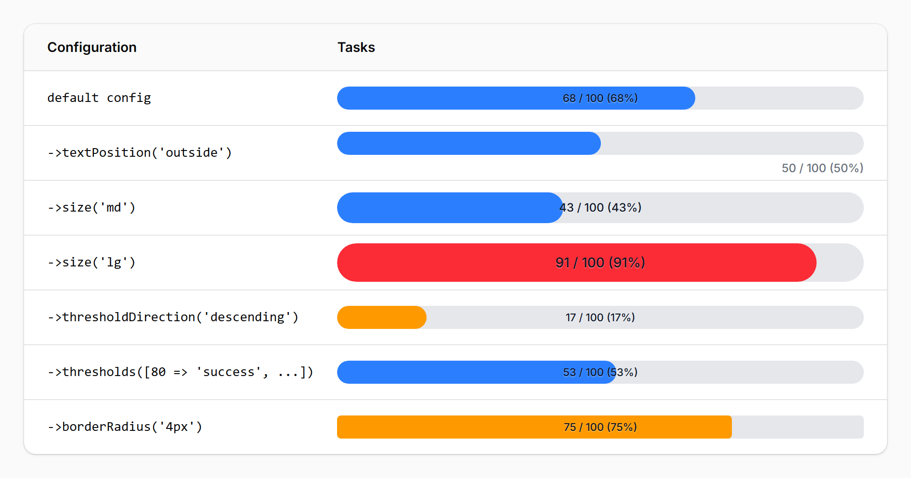</td>
<td width="50%">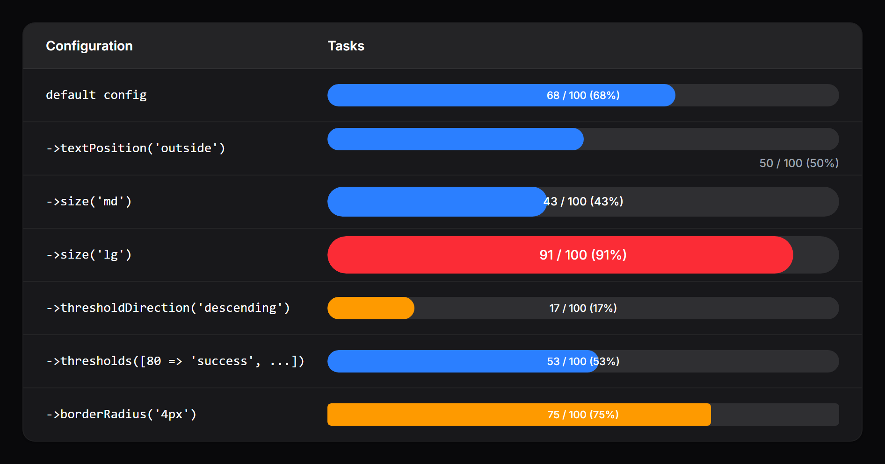</td>
</tr></table>

A `ProgressBarEntry` inside an infolist with icons, custom labels, and a descending-threshold "Stock remaining" bar:

<table><tr>
<td width="50%">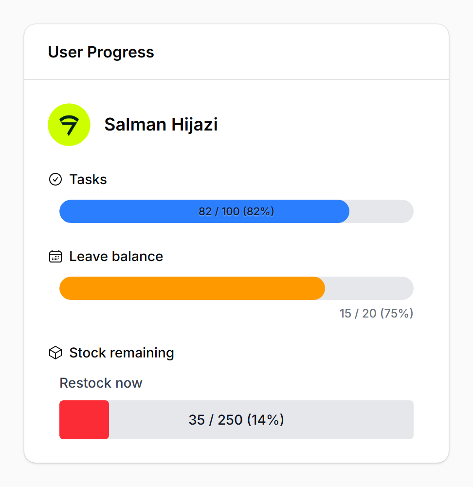</td>
<td width="50%">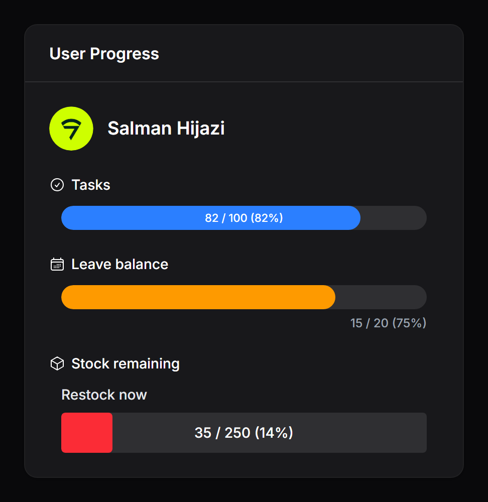</td>
</tr></table>

## Need something custom?

If you'd like custom features, extensions, or a tailored variant of this package built for your project, reach out at [salman@devletes.com](mailto:salman@devletes.com).

## Credits

- [Salman Hijazi](https://www.linkedin.com/in/syedsalmanhijazi/)

## License

MIT. See [LICENSE.md](LICENSE.md).
